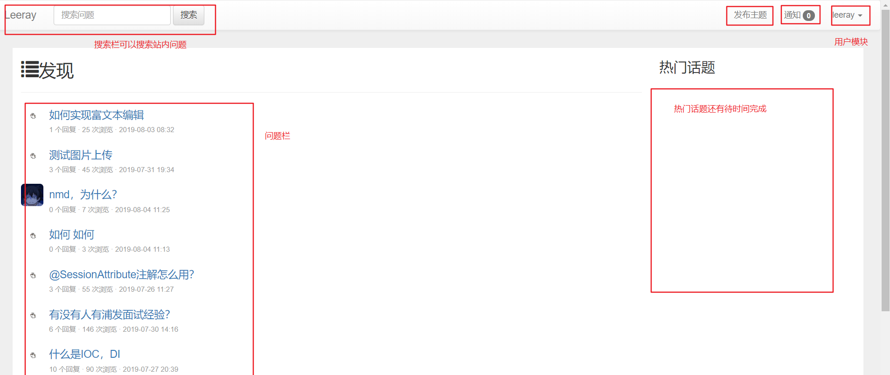

## 模仿elastic search中文社区做的社区网站
环境： 

- jdk1.8
- springboot 2.1.6 （MVC框架）
- mybatis（持久层）
- mysql（关系型数据库）
- druid（数据源监控台）
- idea（开发IDE）
- redis 3.0.0（缓存）
- ucloud-ufile(图片云服务)
- devtools(开发热部署)
- okhttp（模拟http请求）

### 7.28 目前在做点击数统计的逻辑

### 8.4 基本完成项目

### 8.5 添加日志，集成redis

### 8.10 添加本地用户登录注册功能
        坑：ajax表单提交的时候，绑定按钮，点击按钮后会提交表单，但是在开发中
           发现每次请求都会发两次，后来才发现绑定的按钮类型是submit,那么我们
           点击它时他就会自动提交一次，再然后我们的ajax提交一次，重复提交。

### 项目展示

#### 1.首页功能

